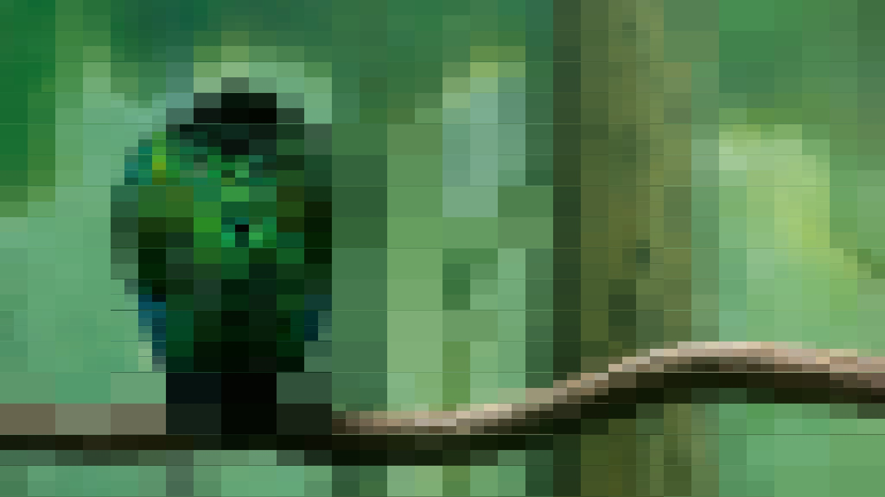
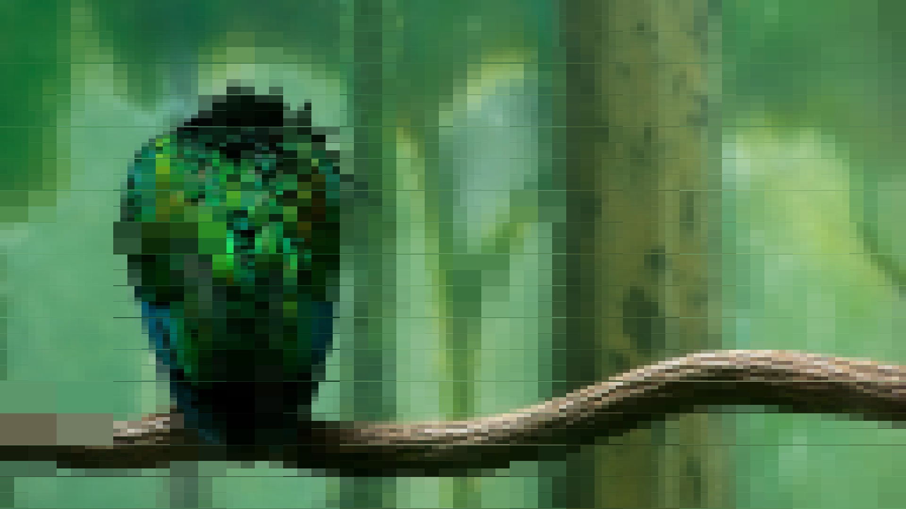

# cpp-quads
Divides an image into quadrants, creating a blockier version of itself.

## How it Works
1. The image is divided into quadrants, with the mean value calculated per quadrant.
2. Each quadrant is then divided into quadrants again, with the mean squared error calculated per sub-quadrant.
3. Quadrants with the highest error are divided further, and this continues for the number of iterations provided by the user

## Original

## Blockified (2,048 iterations)

## Blockified (100,000 iterations)

## A bird example

## Blockified (512 iterations)

## Blockified (3000 iterations)

## Another example

## Blockified (1,024 iterations)

## Blockified (10,500 iterations)

